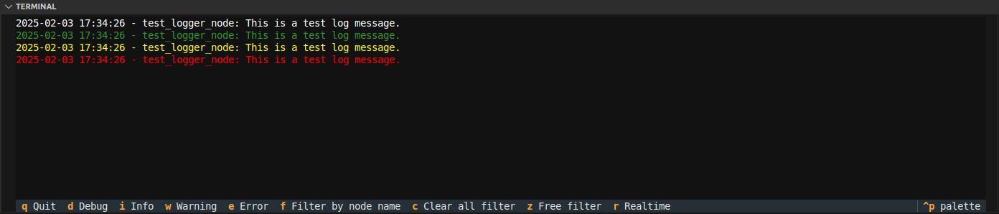
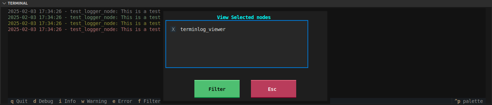
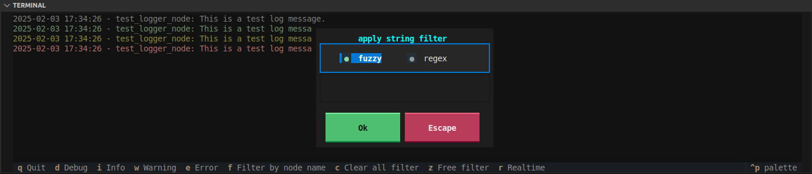

# Termilog

ROS2 node to show and filter `/rosout` topic by:
- log level
- node names
- text in message
  - fuzzy search
  - regex search


## install
### dependencies

```bash
pip install textual
# textual-dev # for development
pip install rapidfuzz
```

## usage

```bash
ros2 run terminlog viewer.py
```




```bash
#run with predefine nodes name

ros2 run terminlog viewer.py --ros-args -p nodes_to_capture:="[node_a, node_b]"
# or

ros2 run terminlog viewer.py --ros-args --params-file params.yaml
```

#### params.yaml
```yaml title="params.yaml"
/terminlog_viewer:
  ros__parameters:
    log_queue_size: 100
    nodes_to_capture:
    - node_a
    - node_b
```


---

### filter by log level
filter log level show all message with selected filter and above

---

### filter by node name
- filter **unselected** node names



---

### filter free text

Filter by **node name** or **message**
use fuzzy or regex filters



---

### realtime
Enabled / Disabled realtime

When realtime **enable** each message push the vertical scroll down
**disabled** allow the user to scroll up without interference

---

### clear all filters

Clear / reset all filters

---

### pallette

**clear**: clear storage, terminlog save X last log event can config by `log_queue_size` parameter, the action clear this storage


---

## issue

### run from launch
The node need to run as separate terminal.

```python
ExecuteProcess(
            cmd=['gnome-terminal', '--','ros2', "run", "terminlog", "viewer.py"],
            output='screen',
            shell=False 
        )
```